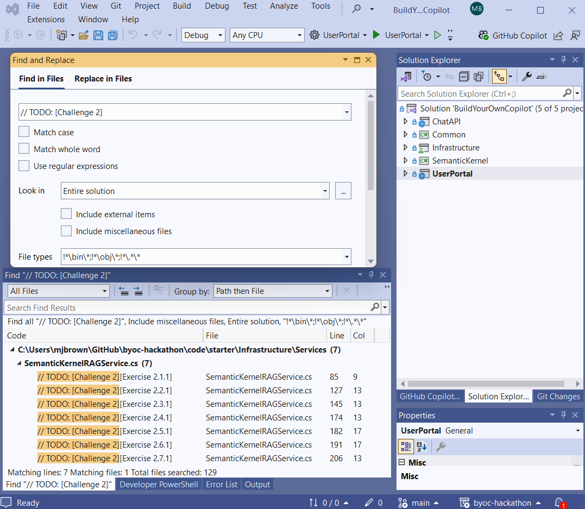

# Challenge 01 - Finding the kernel of truth

[< Previous Challenge](./Challenge-00.md) - **[Home](../README.md)** - [Next Challenge >](./Challenge-02.md)

## Introduction

With the foundation of Semantic Kernel in place, your task in this challenge is to explore the use of plugins, vector memory, and Azure OpenAI services for chat completion. You’ll implement and extend the components needed to build an intelligent assistant that provides responses based on user questions and stored knowledge.

## Description

This challenge is intended to get you familiar with Semantic Kernel that is used extensively to implement this solution. There is no coding in this Challenge. Rather you are asked to read the articles below before going to Visual Studio and searching for the `Challenge 1` items. Here are the suggested readings that will help you address the tasks in the challenge:

- [Understanding the kernel](https://learn.microsoft.com/semantic-kernel/concepts/kernel?pivots=programming-language-csharp)
- [What is a Plugin?](https://learn.microsoft.com/semantic-kernel/concepts/plugins/?pivots=programming-language-csharp)
- [How to use function calling with Azure OpenAI Service](https://learn.microsoft.com/azure/ai-services/openai/how-to/function-calling)
- [What is a Planner?](https://learn.microsoft.com/semantic-kernel/concepts/planning?pivots=programming-language-csharp)
- [Embeddings](https://platform.openai.com/docs/guides/embeddings/use-cases)
- [Build Your Own Copilot with Azure Cosmos DB - Key Concepts](https://github.com/Azure/BuildYourOwnCopilot/blob/main/docs/concepts.md)

The remainder of this hackathon will be spent learning concepts and implementing them in Visual Studio writing code.

For each challenge, you can easily find the code snippets that you need to modify or add by searching for the challenge code in the code files. For example, to identify the code snippets for Challenge 1, search for `[Challenge 1]` in the code files.

In Visual Studio 2022, you can use the `Edit -> Find and Replace -> Find in Files` menu option of the `Ctrl + Shift + F` keyboard command to search for the challenge code. The result of the search will return multiple locations, each labeled as `// TODO: [Challenge X][Exercise X.E.T]` where `X` is the challenge number, `E` is the exercise number, and `T` is the task number.

> [!IMPORTANT]
> Within each challenge, we also recommend that you complete the exercises in the order they are presented. The exercises are designed to build on each other, and completing them in order will help you understand the solution accelerator better. Make sure you read the hints added as code comments to help you complete the tasks.

For some of the challenges we are also providing some open-ended exercises which do not have a specific solution. These exercises are designed to help you think about the solution accelerator and its components in a more creative way. We encourage you to complete these exercises at the end of the hackathon, after you have successfully completed all the challenges and their exercises.

For each challenge the recommended order of operations is the following:

1. Identify all the exercises for the challenge and read the hints provided in the code comments.
2. Attempt to tackle the exercises in the order they are presented. For each exercise, check the list of suggested readings to help you understand the concepts you need to apply (those lists are provided below for each challenge).
3. Take a note of any open-ended exercises and try to complete them at the end of the hackathon.

You may now go to the starter solution in Visual Studio and complete Challege 1. Locate the exercises by searching for `// TODO: [Challenge 1]` as shown in the screenshot above. Then complete each exercise.

This challenge does not have open-ended exercises.

## Success Criteria

To successfully complete this challenge, you must:

- Demonstrate that the Semantic Kernel is properly configured and can make use of Azure OpenAI chat completions.
- Show that the plugins are correctly imported and used by the kernel.
- Verify that both the vector memory store and Cosmos DB memory store are functional.
- Confirm that the text embeddings are correctly generated and aligned with the memory store.
- Test the assistant by interacting with it through the chat interface and verifying that it responds accurately using relevant knowledge.

### Hints

- Pay attention to the plugins in your solution—these are critical for the assistant's ability to retrieve and use knowledge.
- Review the Cosmos DB change feed setup to understand how changes are tracked and applied to the memory store.
- Ensure that the text embedding service aligns with the RAG pattern, as this will directly impact the quality of your assistant's responses.

## Learning Resources

- [Azure Cosmos DB](https://learn.microsoft.com/azure/cosmos-db/)
- [Azure OpenAI service](https://learn.microsoft.com/azure/cognitive-services/openai/overview)
- [Understanding the kernel](https://learn.microsoft.com/semantic-kernel/concepts/kernel?pivots=programming-language-csharp)
- [What is a Plugin?](https://learn.microsoft.com/semantic-kernel/concepts/plugins/?pivots=programming-language-csharp)
- [How to use function calling with Azure OpenAI Service](https://learn.microsoft.com/azure/ai-services/openai/how-to/function-calling)
- [What is a Planner?](https://learn.microsoft.com/semantic-kernel/concepts/planning?pivots=programming-language-csharp)
- [Embeddings](https://platform.openai.com/docs/guides/embeddings/use-cases)
- [Build Your Own Copilot with Azure Cosmos DB - Key Concepts](https://github.com/Azure/BuildYourOwnCopilot/blob/main/docs/concepts.md)

### Explore Further

- Explore the use of planners in Semantic Kernel and how they impact plugin selection and execution.
- Experiment with different text embeddings and observe their effect on the assistant's performance.
